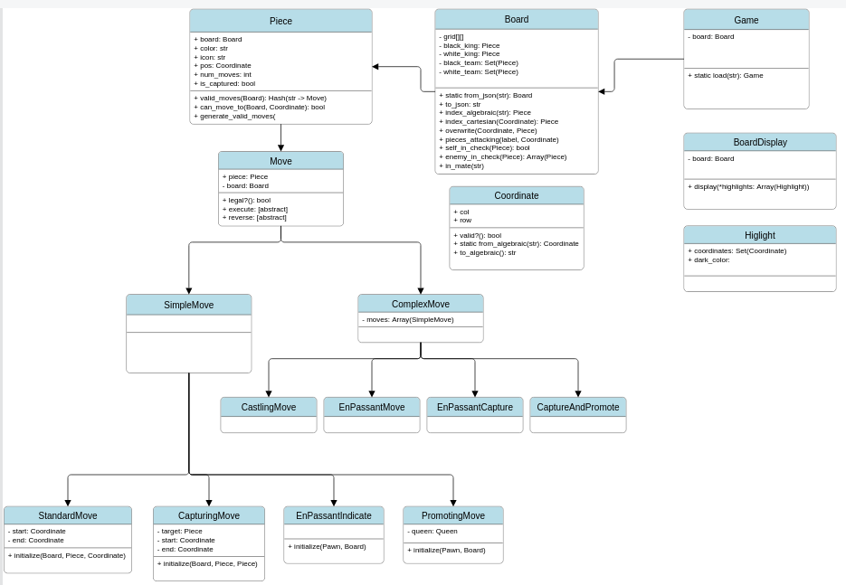

# Chess

This is my capstone project for the Ruby course on [The Odin Project](https://www.theodinproject.com/lessons/ruby-ruby-final-project). It was a truly fun & challenging project, and I'll definitely remember this one fondly. Ultimately I am happy with how it turned out, yet I can feel there is room for improvement.

### Design notes

My goal was to make the design simple and understandable. I broke the game up into its logical parts - the first of which are the data points:
	
- The board
- The pieces

Next, the actions that need to be enabled by the design:

- Display the board (incl. the pieces, of course)
- Select a piece by giving coordinates
- Display legal moves for selected piece overlayed on the board
- Detect if a player is in check
- Detect if a player is in mate
- Move a piece on the board

The last point about "moving a piece" is a complex requirement. Let's break that down:

- Move from A to empty spot B
- Move from A to capture a piece at B
- Move a Pawn from A such that he en-passant captures a Pawn at B
- Move a King and a Rook simultaneously in a "castling" move
- Promote a pawn when it moves to the end of the board

### Design in depth

Those were the notes that carried me forward into my design. Notes aside, this is the diagram I created from these notes which guided my programming:

Unfortunately I was using the free trial of [smartdraw.com](smartdraw.com), which expired before I finished populating some simpler components like Game, BoardDisplay, and Highlights - but this diagram still demonstrates the final design that was used for moving pieces on the board, which was the most challenging aspect.

Put simply, a Board is a collection of Pieces. The Board class is a "model" for maintaining the Pieces, and it exposes accessors and mutators such as `#overwrite()` for overwriting a cell, `#new_piece()` for creating a brand new piece on the board, and `#delete_piece()` for removing a piece. The Board contains a little bit of logic - being the model that stores all of the pieces, it is able to tell you whether a player is checked or mated. (In retrospect, I believe it may have been more idiomatic to separate this logic into a "controller" class to respect the MVC design pattern)

A Piece represents a Piece on the board. This Piece knows its position on the board, and it knows which team its on. It may also be `captured`, meaning it doesn't exist on the board anymore, and its `position` is only its last *known* position. But the most important function of a piece is this: returning a set of valid moves it may perform.

A Move object stores the procedure that will move a piece from A to B and execute any other residual effects of the move. As declared in the UML diagram above, there is a subclass of Move for every possible unique situation. To deduplicate code, some more nuanced moves are called 'Complex Moves', and they are simply a combination of two 'Simple Moves'. For example, an en-passant capture is the only case in Chess where you move your piece from A to B, but you capture an opponent's piece at C. Therefore, it can be thought of as a CapturingMove from A to B, and a StandardMove from B to C.

A complex problem arose when I realized I needed to make sure that a move was *legal* before allowing a player to execute it. A move is only legal if it does *not* put your king into check; therefore, each move must be evaluated to see if it leaves the player's king in check. To make this possible, each Move subclass defines an `#execute()` method and a `#reverse()` method. When it comes time to check legality of a move, the move is simply `#execute()`'d and then the Board is queried to see if the player is now in check. The result of that query is immediately stored and then returned after the Move is `#reverse()`'d. The `#reverse()` undoes the `#execute()`, leaving the Board's state ultimately unchanged, yet giving you an answer to the legality of the Move.

### The result

Ultimately I am fairly happy with the result, being an amateur programmer as I am. The final game loop occupies roughly 50 lines of code, and the design made it fairly easy to put the "pieces" together, so to speak. But I do have two main concerns:

Firstly, I concern that I have broken some fundamental rules of object-oriented programming. To make this design work, I exposed internal state of the Board and Piece classes. Although I am pleased with the design conceptually, in practice I wince at the sight of `public attr_accessor :num_moves, :is_captured` and `public attr_accessor :teams`. I would love some feedback about this issue. Surely this could be improved?

Secondly, although I am comfortable with reading my own code, and I would claim it is readable, I am the only one to have lain eyes on this code. I hope to gather feedback about readability as time goes on so I can write nicer and neater code - and I'm sure there's much to be had.